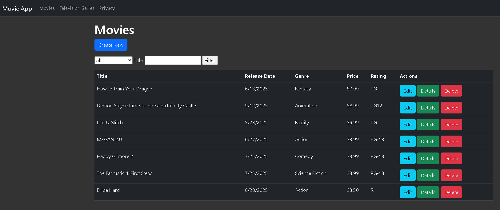

# Movie App

An ASP.NET MVC application for managing a collection of movies and TV shows. The app supports full CRUD operations and includes a search feature.

## Features

- **Create, Read, Update, Delete** movies and TV shows
- Store information: Title, Release Date, Genre, Price, Rating
- **Search** by Title or Genre



## Getting Started

1. **Clone the repository:**

   ```bash
   git clone https://github.com/andymartinez1/Movie-App.git
   ```

2. **Navigate to the project directory:**

   ```bash
   cd Movie-App
   ```

3. **Update the database:**

   ```bash
   dotnet ef database update
   ```

4. **Restore dependencies:**

   ```bash
   dotnet restore
   ```

5. Build and run the app:
   ```bash
   dotnet run
   ```

## Usage

- Add new movies or TV shows via the "Create" page
- View details, edit, or delete entries
- Use the search bar to filter by title or genre

## Technologies

- ASP.NET MVC
- Entity Framework
- SQL Server (LocalDB)
